# System Architecture - Web Ujian AI v2.0

## System Overview


## Data Flow - Student Taking Exam

```mermaid
sequenceDiagram
    participant S as Student
    participant UI as Student Dashboard
    participant API as Backend API
    participant DB as MongoDB
    participant AI as Gemini API
    
    S->>UI: Login with NISN
    UI->>API: POST /api/auth/login
    API->>DB: Find user
    DB-->>API: User data
    API-->>UI: JWT Token
    
    S->>UI: View active exams
    UI->>API: GET /api/exams/active
    API->>DB: Query exams
    DB-->>API: Exam list
    API-->>UI: Display exams
    
    S->>UI: Start exam
    UI->>API: POST /api/submissions/start
    API->>DB: Create submission
    DB-->>API: Submission ID
    
    S->>UI: Answer questions
    UI->>UI: Auto-save locally
    
    S->>UI: Submit exam
    UI->>API: POST /api/submissions/submit
    API->>DB: Save answers
    
    API->>AI: Grade essay questions
    AI-->>API: Scores + feedback
    
    API->>API: Grade MC questions
    API->>DB: Update submission
    DB-->>API: Success
    API-->>UI: Result summary
    UI-->>S: Show score
```



## Database Schema Relationships

```mermaid
erDiagram
    User ||--o{ Class : "teaches/joins"
    User ||--o{ Submission : "submits"
    Class ||--o{ Exam : "contains"
    Exam ||--o{ Submission : "has submissions"
    
    User {
        ObjectId _id
        string username
        string email
        string password
        enum role
        string nisn
        Date lastActive
        boolean isOnline
    }
    
    Class {
        ObjectId _id
        string name
        string subject
        string grade
        ObjectId teacherId
        string inviteCode
        Array studentIds
        Array examIds
    }
    
    Exam {
        ObjectId _id
        ObjectId classId
        string title
        Date startTime
        Date endTime
        Array questions
        boolean isPublished
    }
    
    Submission {
        ObjectId _id
        ObjectId examId
        ObjectId studentId
        Array answers
        number totalScore
        enum status
        Date submittedAt
    }
```

## Component Hierarchy

```
App.tsx
├── Login.tsx
├── OwnerDashboard.tsx
│   ├── SettingsPanel
│   │   ├── APIKeyManager
│   │   ├── DatabaseConfig
│   │   └── StorageModeToggle
│   ├── UserManagement
│   └── SystemStats
│
├── GuruDashboard.tsx
│   ├── ClassList
│   │   ├── ClassCard
│   │   └── CreateClassModal
│   ├── ClassDetail
│   │   ├── StudentList
│   │   ├── ExamList
│   │   └── InviteLink (with QR)
│   ├── ExamBuilder
│   │   ├── QuestionEditor
│   │   ├── MCOptions
│   │   └── FileUploader
│   ├── LiveMonitoring
│   │   ├── StudentStatusGrid
│   │   └── ExamProgress
│   └── ResultsViewer
│
└── StudentDashboard.tsx
    ├── ClassList
    │   └── JoinClassModal
    ├── ActiveExams
    │   └── ExamCard
    ├── ExamPage
    │   ├── QuestionDisplay
    │   ├── EssayAnswer
    │   ├── MCAnswer
    │   └── Timer
    ├── History
    │   └── PastExamCard
    ├── ResultsDetail
    │   ├── QuestionReview
    │   └── ScoreSummary
    └── Performance
        └── AnalyticsChart
```

## API Endpoints

### Authentication
```
POST   /api/auth/login          - Login (all roles)
POST   /api/auth/register       - Register new user
POST   /api/auth/logout         - Logout
GET    /api/auth/me             - Get current user
```

### Classes
```
GET    /api/classes             - Get user's classes
POST   /api/classes             - Create class (guru)
GET    /api/classes/:id         - Get class detail
PUT    /api/classes/:id         - Update class
DELETE /api/classes/:id         - Delete class
POST   /api/classes/join        - Join class (siswa)
GET    /api/classes/:id/students - Get class students
```

### Exams
```
GET    /api/exams               - Get exams (filtered by role)
POST   /api/exams               - Create exam (guru)
GET    /api/exams/:id           - Get exam detail
PUT    /api/exams/:id           - Update exam
DELETE /api/exams/:id           - Delete exam
POST   /api/exams/:id/publish   - Publish exam to class
```

### Submissions
```
GET    /api/submissions         - Get user's submissions
POST   /api/submissions/start   - Start taking exam
POST   /api/submissions/submit  - Submit exam
GET    /api/submissions/:id     - Get submission detail
GET    /api/submissions/exam/:examId - Get all submissions for exam (guru)
```

### Real-time
```
GET    /api/realtime/status     - Get student online status
GET    /api/realtime/progress   - Get exam progress
POST   /api/realtime/heartbeat  - Update online status
```

### Settings (Owner only)
```
GET    /api/settings            - Get settings
PUT    /api/settings            - Update settings
POST   /api/settings/test-db    - Test MongoDB connection
POST   /api/settings/test-api   - Test Gemini API
```

### Users (Owner only)
```
GET    /api/users               - Get all users
POST   /api/users               - Create user
PUT    /api/users/:id           - Update user
DELETE /api/users/:id           - Delete user
PUT    /api/users/:id/suspend   - Toggle suspend
```

## Technology Stack

### Frontend
- **Framework:** React 19 + TypeScript
- **Bundler:** Vite 6
- **Router:** React Router DOM 7
- **Styling:** TailwindCSS 3
- **HTTP Client:** Axios
- **Date Handling:** date-fns
- **Charts:** Recharts (for analytics)

### Backend
- **Runtime:** Node.js 18+
- **Framework:** Express 4
- **Database:** MongoDB (with Mongoose ODM)
- **Authentication:** JWT + bcrypt
- **Validation:** Joi / Zod
- **File Upload:** Multer
- **CORS:** cors middleware

### External APIs
- **AI Grading:** Google Gemini API (free tier)
- **Database:** MongoDB Atlas (free tier)

## Deployment Architecture

```
┌─────────────────────────────────────┐
│     Frontend (Vercel/Netlify)       │
│     - Static React SPA              │
│     - CDN distribution              │
└──────────────┬──────────────────────┘
               │ HTTPS
               ▼
┌─────────────────────────────────────┐
│     Backend API (Railway/Render)    │
│     - Express server                │
│     - Environment variables         │
└──────────────┬──────────────────────┘
               │
      ├────────┴────────┐
      ▼                 ▼
┌──────────┐    ┌──────────────┐
│ MongoDB  │    │  Gemini API  │
│  Atlas   │    │   (Google)   │
└──────────┘    └──────────────┘
```

## Security Layers

1. **Authentication:** JWT tokens with expiry
2. **Authorization:** Role-based access control (RBAC)
3. **Password:** bcrypt hashing with salt rounds
4. **API Keys:** Stored server-side only
5. **Input Validation:** Sanitize all user inputs
6. **Rate Limiting:** Prevent API abuse
7. **CORS:** Whitelist allowed origins
8. **HTTPS:** Enforce secure connections

## Feature Comparison

| Feature | v1.0 (Current) | v2.0 (Upgraded) |
|---------|----------------|-----------------|
| Database | LocalStorage | MongoDB + Local fallback |
| Roles | Admin, Siswa | Owner, Guru, Siswa |
| Classes | Single exam | Multi-class system |
| Invite | Manual add | Invite link + QR |
| Questions | Essay only | Essay + Multiple Choice |
| Grading | AI only | AI (essay) + Auto (MC) |
| Monitoring | Static | Real-time live tracking |
| Dashboard | Basic | Rich analytics |
| History | None | Full exam history |
| Settings | .env file | UI-based (Owner) |
| Scalability | ~10 users | 100+ concurrent users |
